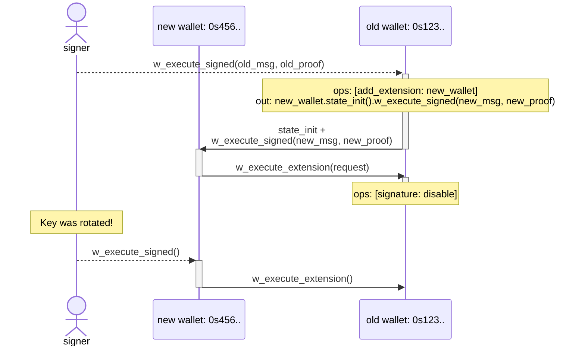

# Wallet Contract

A generic minimalistic wallet smart-contract that enables for true *sharded* and
*extendable* **account abstraction** on Near Protocol.

> **WARN:** This implementation has not been audited yet. **DO NOT** store any
> significant funds on it.

## Key Features

* Execute *arbitrary* [**promise chains**](#promisedag), e.g. `borrow.then(swap).then(repay)`
* [**Extensions**](#extensions) can be implemented as *separate* third-party
  accounts/contracts on Near with their own arbitrary logic. Installed
  extensions have full control over the wallet-contract instance and can be
  added/removed by the signer or other installed extensions. Enables 2FA, social
  recovery and more.
* Can support *any* [**signing standards**](#signing-standards). As of now, we
  have support for **passkeys** (both `p256` and `ed25519`). Additional variants
  can be implemented by *anyone* in the future.
* **Non-sequential** timeout-based [nonces](#nonces) enable *concurrent* request
  and avoid head-of-line blocking.
* `AccountIds` are [deterministically derived](https://github.com/near/NEPs/blob/master/neps/nep-0616.md#deterministic-accountids)
  from wallet initialization state (i.e. public key), so wallet address is known
  even *prior* to the first on-chain interaction. This enables truly **sharded**
  and **composable** on-chain interactions with **no factory** needed.
* Multiple **sub-wallets** can be derived for a single public key by specifying
  different `subwallet_id`s.
* **Zero Balance Accounts**: optimized to fit within [NEP-448](https://github.com/near/NEPs/blob/master/neps/nep-0448.md)
  ZBA limits (770 bytes), so wallets can be created *without* acquiring NEAR
  first.
* [Global Contract](https://github.com/near/NEPs/blob/master/neps/nep-0591.md)
  can be *optionally* **upgradable**  via [Global Deployer](../global-deployer/README.md).

## Architecture

A wallet contract has two main entrypoints for executing requests:

* **Signed requests** via `w_execute_signed(msg, proof)`: the signer constructs
  a `request`, wraps in into a signable message, signs it according to the
  wallet's signing standard, and submits it along with the proof via a
  (permissionless) relayer. The contract verifies chain id, signer id, nonce,
  and signature before execution.
* **Extension requests** via `w_execute_extension(request)`: allowed only for
  enabled extensions, no signature is required.

Each `request` contains:
* `ops`: (optional) list of wallet operations: enable/disable signature,
  add/remove extension
* `out`: (optional) Promise DAG of cross-contract calls to execute.

### Signing Standards

A single wallet-contract variant supports only a single signing standard, which
is fixed at the time of a deployment. Each variant is deployed as a
**separate** global contract.

A public key of the wallet contract instance is also fixed at the time of first
initialization and **cannot** be changed later. However, signature can still be
disabled by signer/extension (see [key rotation](#key-rotation)).

### Extensions

Extensions are **separate** third-party accounts/contracts on Near that can
execute arbitrary requests on behalf of the wallet and have the same full power
over the wallet-contract instance as the original signer does. Extensions can be
added or removed by the signer or other installed extensions.

Extensions is an *open ecosystem* which enable patterns like 2FA, social
recovery, spending limits, session keys, etc.

#### Lockout protection

The contract prevents disabling all authentication methods at once: if signature
is disabled, then at least one extensions must remain enabled. Otherwise, the
whole request fails.

### Nonces

Wallet contract implements **non-sequential** double-timeout window nonces for
replay protection, enabling concurrent request submission from multiple
non-coordinated clients.

* Each signed request message includes a 32-bit `msg.nonce`, `msg.created_at`
  and a corresponding `msg.timeout` which is the *maximum* validity of this
  nonce after `msg.created_at`.
* At the same time, wallet-contract has its own [`wallet.timeout`](#timeout-selection).
* A signed request with given `msg.nonce` is considered valid between
  `msg.created_at` and `msg.created_at + min(msg.timeout, wallet.timeout)`.

Nonces are rotated every `wallet.timeout` and cleaned up after at most
`2 * wallet.timeout`, meaning that each nonce can be safely re-used only after
at least `2 * wallet.timeout`. Otherwise, if the nonce is re-used too early, the
corresponding signed request will fail.

> **NOTE**: The contract ensures that `now() - timeout <= created_at <= now()`,
> where `now()` is the current block timestamp. Due to the desentralized nature
> of consensus in blockchains, block timestamps usually lag a bit behind the
> actual time when it's produced. As a result, clients are recommended to set
> `created_at` slightly (e.g. 60 seconds) before the actual time of signing, so
> that it doesn't fail on-chain if it arrives too fast.

#### Optimal nonce generation algorithm

Despite nonces are stored efficiently and cleaned up every `2 * timeout`, it's
still important to generate them efficiently to reduce the storage usage. The
more sequential nonces are, the less space they consume.

* For **non-concurrent** signers, it's recommended to generate nonces
  *incrementally*:
  ```rust
  let nonce = self.next_nonce;
  self.next_nonce += 1;
  ```
* For **concurrent** signers (e.g. when the user might sign two requests
  concurrently with the same key from different devices), it's recommended to 
  generate nonces *semi-sequentially* where each 32 nonces are generated
  sequentially but then a new random nonce is selected:
  ```rust
  const BIT_POS_MASK: u32 = 0b11111;

  if self.next_nonce & BIT_POS_MASK == 0 {
      self.next_nonce = random_u32() & !BIT_POS_MASK;
  }

  let nonce = self.next_nonce;
  self.next_nonce += 1;
  ```

#### Timeout selection

Wallet's `wallet.timeout` is fixed at the time of initialization and **cannot**
be changed afterwards. Nonces are cleaned up every `2 * wallet.timeout`. The
longer the timeout, the more storage usage in highload environments.

Recommended timeout for production use is `1 hour`.

### Subwallets

A single public key can control multiple wallet contracts by varying the `wallet_id` field in the initialization state. Each subwallet has a distinct deterministic `AccountId`.

### `PromiseDAG`

Requests can include a DAG of promises, enabling arbitrary-complex cross-contract call chains.

Supported actions within promises are:

| Action | Description |
|--------|-------------|
| `FunctionCall` | Call a contract method |
| `Transfer` | Send NEAR tokens |
| `StateInit` | Deploy a new contract at a [deterministic AccountId](https://github.com/near/NEPs/blob/master/neps/nep-0616.md) |

Other actions (e.g. `DeployContract`, `AddKey`, etc.) are intentionally **not**
supported: wallet contracts are not self-upgradable and do not allow creating
subaccounts.

## Example flows

### Key rotation

Despite wallet contract does not support key rotation by itself due to its
design philosophy, it's still possible to implement key rotation via extensions
while keeping the original address.

To rotate a key for the original wallet, the signer needs to:
1. Create a new keypair
1. Derive a new wallet address from the new public key
1. Prepare a request for the new wallet that calls `w_execute_extension()` method
   on the old wallet and disables signature on it, and sign it by the new key.
1. Prepare another request for the old wallet that adds the new wallet as an
   extension, initializes its state and calls `w_execute_signed()` method on it,
   passing there the request and the corresponding proof from the previous step.
1. Sign the nested request by the old key and relay it to the old wallet.

As a result, signer can now sign by the new key extension requests to the old
wallet, while having a full control over the original address.

