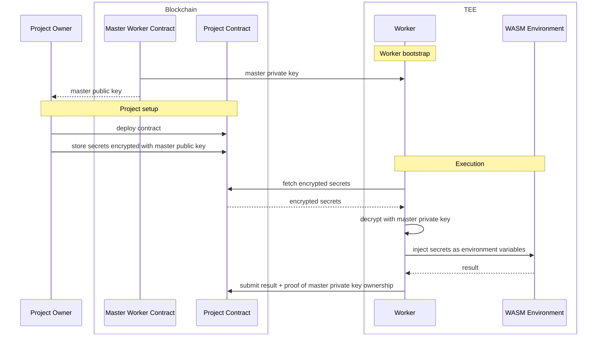
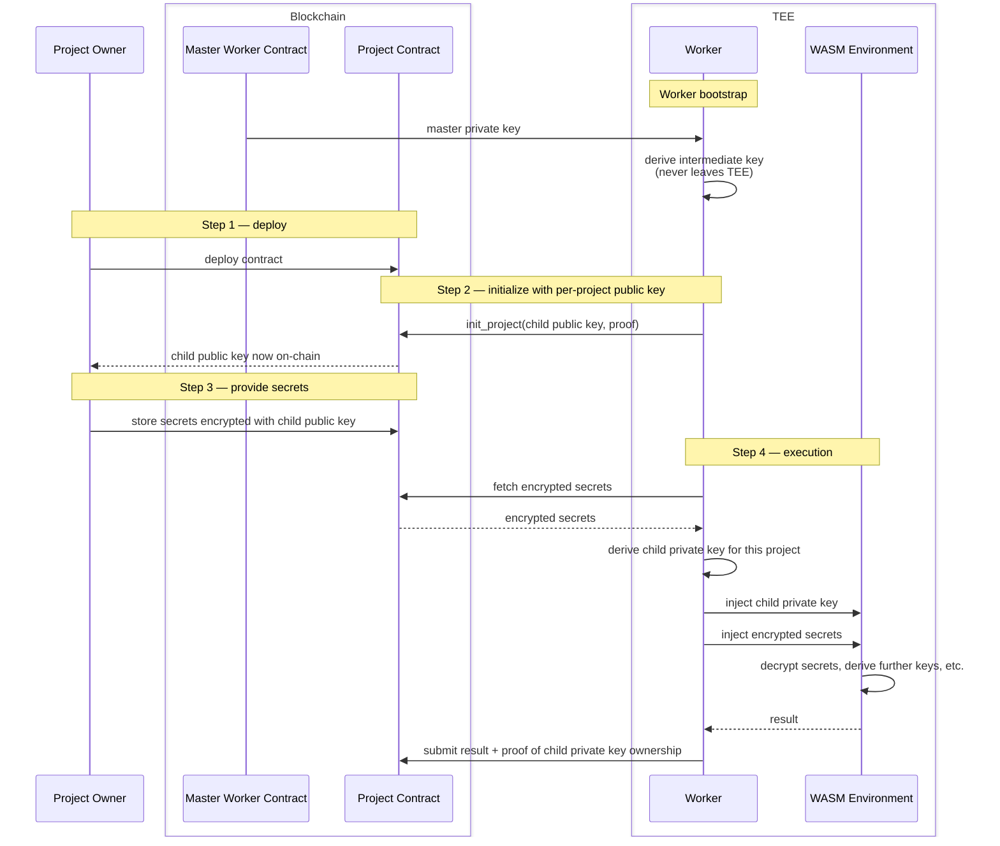

In the MPC contract, knowing a derived private key for one derivation path tells you nothing about any other derived key or the master private key. Each derivation is fully isolated.

This means that if we want each project to have its own encryption key, we would need to request a separate key from the MPC network for each project — one round trip per project. That is inefficient.

---
**Single-keypair architecture**

All project secrets are encrypted using the same key — the master key retrieved from the master worker contract. If this key is ever compromised, an attacker can decrypt every secret ever stored, across all projects.

**Per-project-keypair architecture**

When the worker receives the master key from the master worker contract, it derives an intermediate private key from it (by hashing it). Per-project child keys are then derived from this intermediate key using the project ID as the derivation path. The intermediate public key is never exposed — only the per-project child public key is published on-chain.

When a new project is deployed, the worker initialises it by providing a child public key unique to that project. The project owner then encrypts their secrets with that key. On execution, the worker derives the matching child private key and injects it directly into the WASM environment. The WASM can use it to decrypt secrets, derive further keys, or anything else.

**Why the intermediate public key must never be exposed:**

In non-hardened derivation, if someone knows the master public key and manages to obtain any child private key, they can recover the master private key — and from it derive every other project's private key. By keeping the intermediate public key hidden inside the TEE, this attack is blocked. Child public keys can be published safely.

**Note:** This also removes the need for the worker to manage secret decryption on behalf of WASM. Instead of injecting decrypted secrets as environment variables, the worker simply hands the child private key to the WASM and lets it handle everything.

**Note:** The per-project public key does not have to be stored on-chain. Alternatives include requesting it directly from the TEE worker via a synchronous HTTP call, or through a dedicated TEE component responsible solely for serving public keys. However, both approaches come with infrastructure concerns — a publicly reachable TEE endpoint is an attack surface and would need protection against DDoS and similar threats. Storing the public key on-chain during project initialization keeps it simple and avoids this.

## Security assumptions

Even though the single-keypair architecture uses one master private key for all projects, it does not fundamentally violate any security assumptions — the key never leaves the TEE worker. And while the per-project-keypair architecture may seem more elegant, it is not meaningfully more secure: if the TEE environment is compromised, an attacker would still be able to decrypt all secrets persisted on-chain, regardless of how many keypairs are involved. The real advantage of the per-project approach is not stronger isolation against TEE compromise, but rather that it moves secret decryption and key management into the WASM itself. This opens up interesting possibilities — for example, projects that exchange information securely using a keypair that no single entity fully controls.

