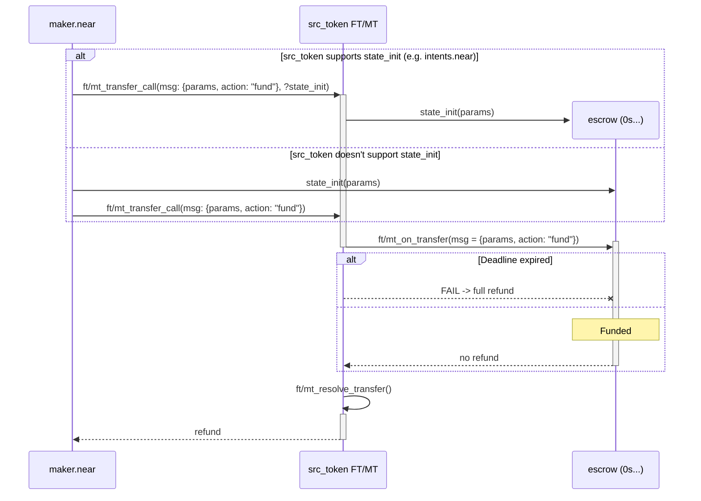
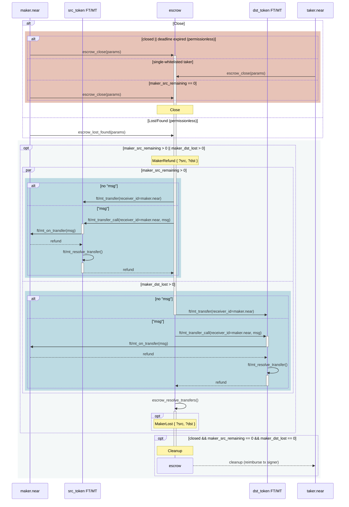

# Escrow-Swap Smart-Contract

Deterministic escrow-swap smart-contract that locks the maker’s
`src_token` and lets whitelisted (or permissionless) takers fill it by
sending `dst_token`.

## Features

* **Deterministic deployment**: the AccountId is deterministically derived from [params](#params).
* **Immutable**: all [params](#params) are immutable and fixed at the time of initialization.
* **Off-chain auction**: can be implemented by whitelisting a single proxy-taker.
* **Partial fills**: opt-in which enables better prices and allows to swap large amounts with
  fewer liquidity available.
* **Token-agnostic**: supports any [NEP-141][3] and [NEP-245][4] tokens for `src_token` and `dst_token`.
* **Composability**: both maker and takers can receive tokens to any other account via
  `ft/mt_transfer[_call]()`.
* **Automatic cleanup**: once closed and all balances are zero and callbacks finished, the
  contracts automatically deletes itself.

## Params

All params of the escrow are fixed at the time of initialization and immutable:

> Fields are required unless annotated with `(optional)`.

```jsonc
{
  // The only maker authorized to fund the contract with `src_token`
  "maker": "maker.near",

  // The token the maker wants to sell. Supported variants:
  // * `nep141:<CONTRACT_ID>`
  // * `nep245:<CONTRACT_ID>:<TOKEN_ID>`
  "src_token": "nep245:intents.near:nep141:usdt.tether-token.near",

  // The token the maker expects to receive in return. Supported variants:
  // * `nep141:<CONTRACT_ID>`
  // * `nep245:<CONTRACT_ID>:<TOKEN_ID>`
  "dst_token": "nep245:intents.near:nep141:wrap.near",

  // The mininum price, expressed as decimal floating-point number
  // representing the amount of raw units of `dst_token` per 1 raw unit
  // of `src_token`, i.e. dst per 1 src.
  "price": "0.0000001667",

  // Deadline for taker(s) to fill the escrow, in RFC3339 format.
  // After deadline has exceeded, anyone can close the escrow (permissionless).
  "deadline": "2024-07-09T00:00:00Z",

  // (optional) Whether partial fills are allowed.
  "partial_fills_allowed": true,

  // (optional) Override where to refund `src_token` after escrow is closed.
  "refund_src_to": {
    // (optional) Receiver's account_id, `maker` otherwise.
    "receiver_id": "vault.maker.near",
    // (optional) memo for `ft/mt_transfer[_call]()`
    "memo": "<MEMO>",
    // (optional) Message for `ft/mt_transfer_call()`.
    // If not specified, `ft/mt_transfer()` will be used by default.
    "msg": "<MESSAGE>",
    // (optional) Minimum amount of gas that should be attached
    // to `ft/mt_transfer[_call]()`
    "min_gas": "50000000000000"
  },

  // (optional) Override where to receive `dst_token` on each fill.
  "receive_dst_to": {
    // (optional) Receiver's account_id, `maker` otherwise.
    "receiver_id": "treasury.maker.near",
    // (optional) memo for `ft/mt_transfer[_call]()`
    "memo": "<MEMO>",
    // (optional) Message for `ft/mt_transfer_call()`.
    // If not specified, `ft/mt_transfer()` will be used by default.
    "msg": "<MESSAGE>",
    // (optional) Minimum amount of gas that should be attached
    // to `ft/mt_transfer[_call]()`.
    "min_gas": "50000000000000"
  },

  // (optional) Whitelist for takers that allowed to fill the escrow.
  //
  // Empty whitelist means anyone can fill.
  //
  // If consists of a single taker, then he has a permission to close
  // the escrow even before the deadline.
  "taker_whitelist": ["solver-bus-proxy.near"],

  // (optional) Protocol fees (collected on on `dst_token`)
  "protocol_fees": {
    // The fee that is taken on `taker_dst_used` on every fill.
    //
    // Fees are measured in "pips", where:
    // 1 pip == 1/100th of bip == 0.0001%.
    "fee": 2000, // 0.2%

    // The fee that is taken on surplus, i.e. price improvement
    // above maker's `price` (see above), i.e. difference between
    // `taker_dst_used` and `maker_want_dst = src_out * price`.
    //
    // Fees are measured in "pips", where:
    // 1 pip == 1/100th of bip == 0.0001%.
    "surplus": 50000, // 5%

    // Recepient of protocol fees.
    "collector": "protocol.near"
  },

  // (optional) Integrator fees: mapping between fee collector
  // and corresponding fee taker on `taker_dst_used`.
  //
  // Fees are measured in "pips", where:
  // 1 pip == 1/100th of bip == 0.0001%.
  "integrator_fees": {
    "front-end.near": 3000, // 0.3%
    "partner.near":   1000  // 0.1%
  },

  // (optional) Contract that's allowed to forward `on_auth()` calls
  "auth_caller": "intents.near",

  // 32 bytes of entropy encoded in hex, used for address derivation.
  "salt": "9e3779b97f4a7c1552d27dcd1234567890abcdef1234567890abcdef1234"
}
```

The escrow AccountId is deterministically derived from its initialization code and data as
defined in [NEP-616][1].

> Due to storage limitations, the contract only stores the keccak256 hash
> of borsh-serialized `Params`, so it needs to be included in full for every
> external interaction.

## On-chain Flow

### Deploy and Fund

In order to fund the contract with `src_token`, the maker sends it to the escrow contract
by calling `src_token::ft/mt_ransfer_call()` with following `msg` param:

```jsonc
{
  "params": { /* full `Params` */ },
  "action": {
    "action": "fund"
  }
}
```

The contract also needs to be initialized via [`state_init()`][2] first.
This can be done either by maker or any other account permissionlessly before trigerring the
transfer, or there can be a custom support for calling [`state_init()`][2] before
`ft/mt_on_transfer()` implemented on `src_token` level (e.g. `intents.near`):

> **NOTE**: Maker can top-up the escrow contract with `src_token` multiple times
> before the deadline is exceeded.



> **NOTE**: the contract doesn't support paying for `storage_deposits`, so it's a
> responsibility of both maker and takers to ensure that they can receive
> corresponding tokens.

### Fill

In order to fill an escrow, the taker sends `dst_token` to the escrow contract
by calling `dst_token::ft/mt_transfer_call()` with following `msg` param:

```jsonc
{
  "params": { /* full `Params` */ },
  "action": {
    "action": "fill",
    "data": {
      // The actual price to fill at, expressed as decimal floating-point number
      // representing the amount of raw units of `dst_token` per 1 raw unit
      // of `src_token`, i.e. dst per 1 src.
      // 
      // The price MUST be greater than or equal to maker's price (see in `params`).
      "price": "0.000000175",

      // (optional) Override where to receive `src_token` to.
      "receive_src_to": {
        // (optional) Receiver's account_id, `sender_id` otherwise.
        "receiver_id": "treasury.taker.near",
        // (optional) memo for `ft/mt_transfer[_call]()`
        "memo": "<MEMO>",
        // (optional) Message for `ft/mt_transfer_call()`.
        // If not specified, `ft/mt_transfer()` will be used by default.
        "msg": "<MESSAGE>",
        // (optional) Minimum amount of gas that should be attached
        // to `ft/mt_transfer[_call]()`
        "min_gas": "50000000000000"
      }
    }
  }
}
```

> **WARN**: The contract doesn't track refunds for takers, mainly due to limited
> storage size. As a result, any refund of `src_token` sent to taker's receiver
> will be PERMANENTLY LOST.  
> Thus, takers need to make sure that they have enough `storage_deposit` on
> `src_token` and specified `min_gas` is sufficient to cover corresponding
> `src_token::ft/mt_transfer[_call]()`.


### Close and Refund

The escrow contract can be closed by calling `escrow_close({"params": {...}})`
method if at least one of the following conditions is met:
* `deadline` has already expired (permissionless)
* by single-whitelisted taker, i.e. to refund the maker before the `deadline`
* by `maker` when `maker_src_remaining` is zero

After being closed, the contract does not allow funding and anymore.
Instead, the contract automatically refunds `maker_src_remaining` (if any)
and retries sending `maker_dst_lost` (if any) and deletes itself if no more
tokens were lost.

Alternatively, a fully permissionless `lost_found({"params": {...}})` method can be called
to retry sending `maker_dst_lost` (if any) even before the `deadline`.

Both methods return a boolean indicating whether the contract was deleted, so
you can stop indexing it. Otherwise, there MAY still be some lost tokens there
(or in-flight).



## View Methods

Once deployed, `escrow_view()` view-method can be used to retrieve the current
state:

```jsonc
{
  // keccak256 hash of borsh-serialized `Params` above, encoded in hex.
  "params_hash": "dde72b47ba69d9bee23ad59a962970637c781352fecff450479c956620c3623c",

  // (optional) Whether the escrow was closed
  "closed": false,

  // Deadline for taker(s) to fill the escrow, in RFC3339 format.
  // MUST be equal to `deadline` specified in `Params`.
  // After deadline has exceeded, anyone can close the escrow (permissionless).
  "deadline": "2025-11-18T18:35:36.572677Z",

  // Maker's remaining amount of `src_token` to be filled.
  "maker_src_remaining": "1000000",

  // (optional) Maker's amount of `dst_token` lost during payouts.
  "maker_dst_lost": "0",

  // (optional) Internal counter of in-flight callbacks.
  "in_flight": 0,
}
```

## Events

#### `funded`

```jsonc
{
  "standard": "escrow-swap",
  "version": "0.1.0",
  "event": "funded",
  "data": {
    "params": { /* ... */ },
    "maker_src_added": "5000000",
    "maker_src_remaining": "5000000"
  }
}
```

#### `fill`
```jsonc
{
  "standard": "escrow-swap",
  "version": "0.1.0",
  "event": "fill",
  "data": {
    "maker": "maker.near",
    "taker": "taker.near",
    "src_token": "nep245:intents.near:nep141:usdt.tether-token.near",
    "dst_token": "nep245:intents.near:nep141:wrap.near",
    "taker_price": "0.000000175",
    "maker_price": "0.0000001667",
    "taker_dst_in": "525000000000000000000000",    // received from taker
    "taker_dst_used": "525000000000000000000000",  // actually consumed
    "src_out": "3000000",                          // sent to taker
    "maker_dst_out": "512730000000000000000000",   // sent to maker
    "maker_src_remaining": "2000000",              // remaining src after sent
    "taker_receive_src_to": "solver.near",         // taker's src receiver
    "maker_receive_dst_to": "maker.treasury.near", // maker's dst receiver
    "protocol_dst_fees": {                 // (optional)
      "fee": "2625000000000000000000",     // (optional)
      "surplus": "1245000000000000000000", // (optional)
      "collector": "protocol.near"
    },
    "integrator_dst_fees": { // (optional)
      "front-end.near": "7875000000000000000000",
      "partner.near": "525000000000000000000"
    }
  }
}
```

#### `closed`
```jsonc
{
  "standard": "escrow-swap",
  "version": "0.1.0",
  "event": "closed",
  "data": {
    "reason": "deadline_expired" // or: "by_single_taker", "by_maker"
  }
}
```

#### `maker_refunded`
```jsonc
{
  "standard": "escrow-swap",
  "version": "0.1.0",
  "event": "maker_refunded",
  "data": {
    "src": "2000000", // (optional) src_token refunded after close
    "dst": "0", // (optional) dst_token returned after being lost
  }
}
```

#### `maker_lost`
```jsonc
{
  "standard": "escrow-swap",
  "version": "0.1.0",
  "event": "maker_lost",
  "data": {
    "src": "1234", // (optional) src_token lost after close
    "dst": "1000" // (optional) maker's lost dst (e.g. lack of `storage_deposit`)
  }
}
```

#### `cleanup`

```jsonc
{
  "standard": "escrow-swap",
  "version": "0.1.0",
  "event": "cleanup"
}
```

## Future Improvements

* **Embedded Lending**: (opt-in) allow takers to borrow `src_token`
  against collateral in `dst_token` by the fixed `price` and LTV ratio
  specified at the initialization stage.
* **Sharded FTs**: we will need to adjust the implementation to add support for sharded fungible
  token standard once it's released.

[1]: https://github.com/near/NEPs/blob/master/neps/nep-0616.md#deterministic-accountids "NEP-616: Deterministic AccountIds"
[2]: https://github.com/near/NEPs/blob/master/neps/nep-0616.md#stateinit-action "NEP-616: `state_init()`"
[3]: https://github.com/near/NEPs/blob/master/neps/nep-0141.md "NEP-141: Fungible Token Standard"
[4]: https://github.com/near/NEPs/blob/master/neps/nep-0245.md "NEP-245: Multi Token Standard"