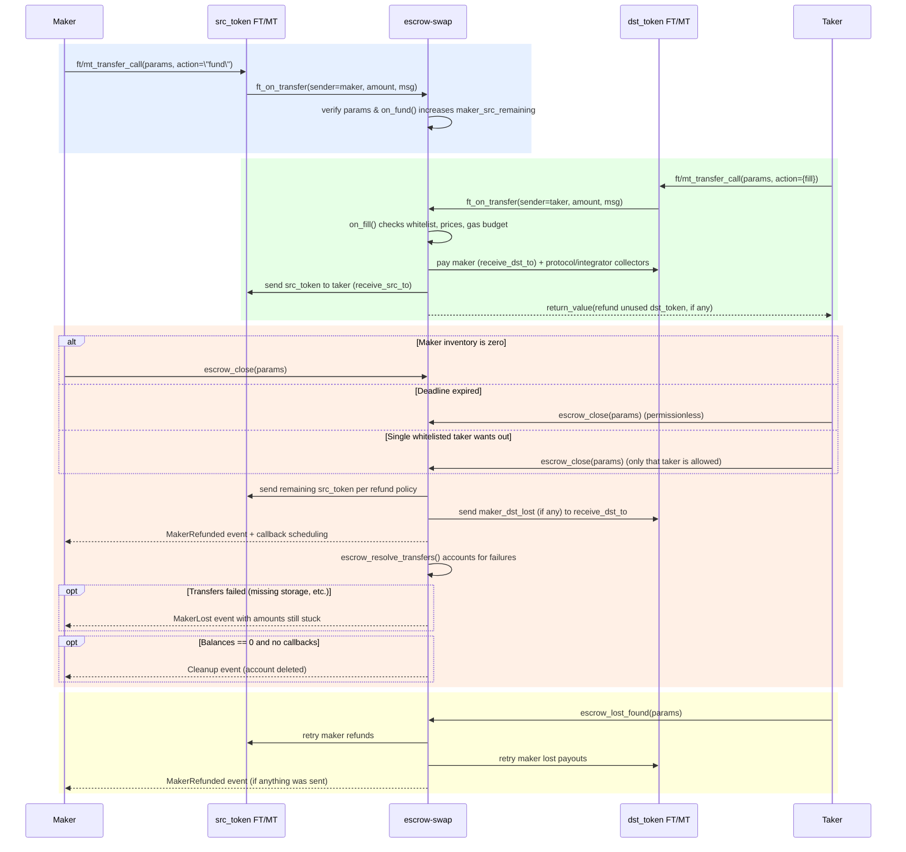

# Defuse Escrow Swap

Deterministic single-escrow contract that locks the maker’s source asset and lets whitelisted (or permissionless) takers fill it via NEP-141/NEP-245 transfers. All settlement parameters are immutable and verified on every call through a stored hash.

## Highlights
- **Deterministic deployment** – the escrow account id is derived from the serialized `Storage` blob (which embeds `Params`) so factory + salt uniquely define an escrow.
- **Token-agnostic** – both `src_token` and `dst_token` are typed `TokenId` (NEP-141 or NEP-245). In JSON they are canonically serialized as `"<variant>:<contract_id>:<token_id?>"`.
- **Immutable intent** – every method expects the exact same `Params` JSON. Any deviation trips `Error::InvalidData`.
- **Maker-centric safety** – maker funds remain locked until filled, the deadline expires, or an authorized closer triggers `escrow_close`. Partial fills are opt-in.
- **Robust accounting** – fee collectors are paid during fills, refunds rely on `return_value`, and `MakerRefunded`/`MakerLost` events track every outgoing transfer.
- **Cleanup aware** – once all balances are zero and callbacks settled, the contract deletes its own account and emits `Cleanup`.

---

## Actors & Lifecycle Summary
1. **Factory** deploys `escrow-<hash>.<factory>` and calls `escrow_init(params)`.
2. **Maker** funds the escrow by sending `src_token` via `ft_transfer_call` or `mt_transfer_call` with `action = "fund"`.
3. **Takers** send `dst_token` to fill the escrow using `action = {"fill": {...}}`. Fill logic enforces prices, whitelists, and fee schedules.
4. **Closers** (maker, anyone after the deadline, or a single whitelisted taker) call `escrow_close`. Anyone can retry settlements with `escrow_lost_found`.
5. **Cleanup** happens automatically when the escrow is closed, has zero balances, and no callbacks in flight.

---

## On-chain Flow



---

## `Params` JSON Template

Every user-facing entrypoint receives the full `Params` struct. The contract hashes the canonical serialization, so callers **must** provide bit-identical data. Token ids below follow the NEP-245 string encoding (`nep245:<contract_id>:<token_id>`).

```jsonc
{
  // maker locking the src token and authorizing specific closings
  "maker": "maker.near",

  // token the maker deposits (intents.near wrapping USDT as NEP-245)
  "src_token": "nep245:intents.near:nep141:usdt.tether-token.near",

  // token takers pay with (intents.near wrapping wNEAR)
  "dst_token": "nep245:intents.near:nep141:wrap.near",

  // maker wants at least 0.1667 NEAR per 1 USDT (dst per src).
  // Expressed per raw src unit (1 USDT = 1_000_000 units), so 0.0000001667 NEAR.
  "price": "0.0000001667",

  // RFC3339 timestamp – fills after this instant fail and anyone may close
  "deadline": "2024-07-09T00:00:00Z",

  // allow partial fills; otherwise taker must consume the entire escrow
  "partial_fills_allowed": true,

  // optional override describing where leftover src_token should be refunded
  "refund_src_to": {
    "receiver_id": "maker.vault.near",
    "memo": "escrow-refund-42",
    "msg": "{\"tag\":\"refund\"}",
    "min_gas": "25000000000000"
  },

  // optional override for maker’s dst_token payout destination
  "receive_dst_to": {
    "receiver_id": "maker.treasury.near",
    "memo": "escrow-fill-42",
    "msg": "{\"route\":\"treasury\"}",
    "min_gas": "40000000000000"
  },

  // restrict fills to trusted takers (single entry enables “taker cancel” close)
  "taker_whitelist": ["solver-bus-proxy.near"],

  // pct-based protocol fees (values are pips: 1 pip = 0.0001%)
  "protocol_fees": {
    "fee": 5000,     // 0.5% of taker_dst_used paid every fill
    "surplus": 50000, // 5% of price improvement above maker_price
    "collector": "protocol.near"
  },

  // arbitrary fee split among integrators (also pips)
  "integrator_fees": {
    "front-end.near": 15000, // 1.5% of taker_dst_used
    "partner.near": 1000     // 0.1%
  },

  // optional contract allowed to forward authenticated calls (feature gated)
  "auth_caller": "intents.near",

  // 32 bytes of entropy, used by factories for deterministic account ids
  "salt": "9e3779b97f4a7c1552d27dcd1234567890abcdef1234567890abcdef1234"
}
```

> **Tip**: keep copies of this template when crafting fills—`TransferMessage` always embeds the **entire** `Params` object, not just the fields you changed.

---

## Transfer Messages

Funding and filling both use NEAR standards `ft_transfer_call` / `mt_transfer_call`. The message payload is a JSON blob matching `TransferMessage`:

### Funding (`action = "fund"`)

```jsonc
{
  "params": { /* ... */ },
  "action": {
    "action": "fund"
  }
}
```

- `sender_id` must equal `params.maker`.
- Token must equal `params.src_token`.
- Amount increases `maker_src_remaining`.

### Filling (`action = {"fill": {...}}`)

```jsonc
{
  "params": { /* ... */ },
  "action": {
    "action": "fill",
    "data": {
      // taker’s quote per raw src unit (1 USDT = 1_000_000 units), equals 0.175 NEAR / USDT
      "price": "0.000000175",

      // optional override for where src_token is delivered
      "receive_src_to": {
        "receiver_id": "solver.near",
        "memo": "swap-42",
        "msg": "{\"claim\":\"vault\"}",
        "min_gas": "30000000000000"
      }
    }
  }
}
```

- Token must equal `params.dst_token`.
- Caller must be in `taker_whitelist` if one is configured.
- `receive_src_to` defaults to the taker when omitted.
- Any unused `dst_token` is refunded via `return_value` (so the FT resolves naturally).

---

## Contract Interface

| Method | Description |
| --- | --- |
| `escrow_init(params: &Params)` | Deploy-time initializer. Validates params, emits `Created`, and stores the params hash. |
| `escrow_view(&self) -> &Storage` | View call returning `Storage { params_hash, state }`. Useful for indexers that already know the params. |
| `escrow_close(&mut self, params: Params)` | Closes the escrow when: (a) maker calls and `maker_src_remaining == 0`, (b) anyone calls after `deadline`, or (c) the sole whitelisted taker calls. Triggers `lost_found`. |
| `escrow_lost_found(&mut self, params: Params)` | Permissionless sweep that resends maker refunds (`MakerRefunded`) and schedules callbacks to detect losses. |
| `escrow_resolve_transfers(maker_src, maker_dst)` | Private callback. Accounts for refunds, emits `MakerLost` for any failed payouts, and attempts cleanup. |
| `on_auth(&mut self, signer, msg)` | Available when the `auth_call` feature is enabled. Expects a signed JSON payload (`{ params, action }`) and enforces `params.auth_caller == predecessor`. Currently supports closing. |

All methods return `PromiseOrValue<_>` so callers can await token transfer completion. Attempting to mutate state while a cleanup promise is pending results in `Error::CleanupInProgress`.

---

## Events

| Event | When | Payload snapshot |
| --- | --- | --- |
| `Created` | `escrow_init` | Full `Params`. |
| `Funded` | `on_fund` | Maker id, tokens, price, deadline, amounts added/remaining. |
| `Fill` | `on_fill` | Maker + taker ids, token ids, price comparison, volumes, payout overrides, fee breakdowns. |
| `Closed` | `escrow_close` | `reason` ∈ `{deadline_expired, by_maker, by_single_taker}`. |
| `MakerRefunded` | `escrow_lost_found` | Amounts sent back to maker after closing. |
| `MakerLost` | `escrow_resolve_transfers` | Amounts that bounced (e.g., missing storage deposit). |
| `Cleanup` | Account deletion succeeded. |

### Event JSON (JSONC) Examples

#### Created
```jsonc
{
  "standard": "escrow-swap",
  "version": "0.1.0",
  "event": "created",
  "data": [
    {
      "maker": "maker.near",
      "src_token": "nep245:intents.near:nep141:usdt.tether-token.near",
      "dst_token": "nep245:intents.near:nep141:wrap.near",
      "price": "0.0000001667",
      "deadline": "2024-07-09T00:00:00Z",
      "partial_fills_allowed": true,
      "refund_src_to": { "receiver_id": "maker.vault.near", "memo": "escrow-refund-42", "msg": "{\"tag\":\"refund\"}", "min_gas": "25000000000000" },
      "receive_dst_to": { "receiver_id": "maker.treasury.near", "memo": "escrow-fill-42", "msg": "{\"route\":\"treasury\"}", "min_gas": "40000000000000" },
      "taker_whitelist": ["solver-bus-proxy.near"],
      "protocol_fees": { "fee": 5000, "surplus": 50000, "collector": "protocol.near" },
      "integrator_fees": { "front-end.near": 15000, "partner.near": 1000 },
      "auth_caller": "intents.near",
      "salt": "9e3779b97f4a7c1552d27dcd1234567890abcdef1234567890abcdef1234"
    }
  ]
}
```

#### Funded
```jsonc
{
  "standard": "escrow-swap",
  "version": "0.1.0",
  "event": "funded",
  "data": [
    {
      "maker": "maker.near",
      "src_token": "nep245:intents.near:nep141:usdt.tether-token.near",
      "dst_token": "nep245:intents.near:nep141:wrap.near",
      "maker_price": "0.0000001667",
      "deadline": "2024-07-09T00:00:00Z",
      "maker_src_added": "5000000",   // 5 USDT (6-decimal asset)
      "maker_src_remaining": "5000000"
    }
  ]
}
```

#### Fill
```jsonc
{
  "standard": "escrow-swap",
  "version": "0.1.0",
  "event": "fill",
  "data": [
    {
      "taker": "solver.near",
      "maker": "maker.near",
      "src_token": "nep245:intents.near:nep141:usdt.tether-token.near",
      "dst_token": "nep245:intents.near:nep141:wrap.near",
      "taker_price": "0.000000175",
      "maker_price": "0.0000001667",
      "taker_dst_in": "525000000000000000000000",    // 0.525 NEAR sent
      "taker_dst_used": "525000000000000000000000",  // full amount consumed
      "src_out": "3000000",                          // 3 USDT delivered
      "maker_dst_out": "512730000000000000000000",   // 0.51273 NEAR after fees
      "maker_src_remaining": "2000000",              // 2 USDT left
      "taker_receive_src_to": "solver.near",
      "maker_receive_dst_to": "maker.treasury.near",
      "protocol_dst_fees": {
        "fee": "2625000000000000000000",          // 0.5% of taker_dst_used
        "surplus": "1245000000000000000000",      // 5% of price improvement
        "collector": "protocol.near"
      },
      "integrator_dst_fees": {
        "front-end.near": "7875000000000000000000", // 1.5%
        "partner.near": "525000000000000000000"     // 0.1%
      }
    }
  ]
}
```

#### Closed
```jsonc
{
  "standard": "escrow-swap",
  "version": "0.1.0",
  "event": "closed",
  "data": [
    { "reason": "deadline_expired" }
  ]
}
```

#### MakerRefunded
```jsonc
{
  "standard": "escrow-swap",
  "version": "0.1.0",
  "event": "maker_refunded",
  "data": [
    {
      "src": "2000000", // src returned after close (2 USDT)
    }
  ]
}
```

#### MakerLost
```jsonc
{
  "standard": "escrow-swap",
  "version": "0.1.0",
  "event": "maker_lost",
  "data": [
    {
      "dst": "2000000000000000000000" // dst that failed to reach maker (e.g., lack of storage_deposit)
    }
  ]
}
```

#### Cleanup
```jsonc
{
  "standard": "escrow-swap",
  "version": "0.1.0",
  "event": "cleanup"
}
```

---

## Error Codes

| Error | When it occurs |
| --- | --- |
| `Closed` | Funding or filling after the escrow is closed. |
| `CleanupInProgress` | Any mutation while the cleanup guard already dropped the state. |
| `DeadlineExpired` | Initialization with an already-expired deadline or fill after it elapsed. |
| `ExcessiveFees` | Sum of integrator fees exceeds 25% or protocol fee calculations overflow. |
| `ExcessiveGas` | Required outbound transfer gas exceeds safe limits. |
| `IntegerOverflow` | Arithmetic overflow during accounting. |
| `InsufficientAmount` | Transfer amount was zero or too small. |
| `InvalidData` | Provided `Params` hash mismatched stored `params_hash`. |
| `JSON` | Malformed transfer/auth message. |
| `PartialFillsNotAllowed` | Maker disabled partial fills yet taker attempted one. |
| `PriceTooLow` | Maker price zero during init or taker price < maker price. |
| `SameTokens` | `src_token == dst_token`. |
| `Unauthorized` | Caller not permitted (fund vs. fill vs. close). |
| `WrongToken` | Transfer received on an unexpected token contract. |

---

## Example Lifecycle (numbers correspond to the JSON above)

1. **Deploy** – factory derives `escrow-<hash>.factory.near`, deploys Wasm, and calls `escrow_init(params)`. Event: `Created`.
2. **Fund** – maker sends `5` USDT (raw `5e6` units) via `mt_transfer_call`. Event: `Funded`.
3. **Fill** – whitelisted taker sends `0.525` NEAR (quoted at `0.175` NEAR / USDT, i.e. `0.000000175` per raw unit). Contract delivers `3` USDT, pays protocol + integrators, refunds nothing (entire dst was used). Event: `Fill`.
4. **Close** – once `deadline` passes or `maker_src_remaining == 0`, an authorized closer calls `escrow_close`. Event: `Closed`.
5. **Sweep** – anyone can call `escrow_lost_found` to return the remaining `2` USDT. Event: `MakerRefunded`. Failed payouts later emit `MakerLost`.
6. **Cleanup** – after refunds settle and balances hit zero, `Cleanup` fires and the account deletes itself.
