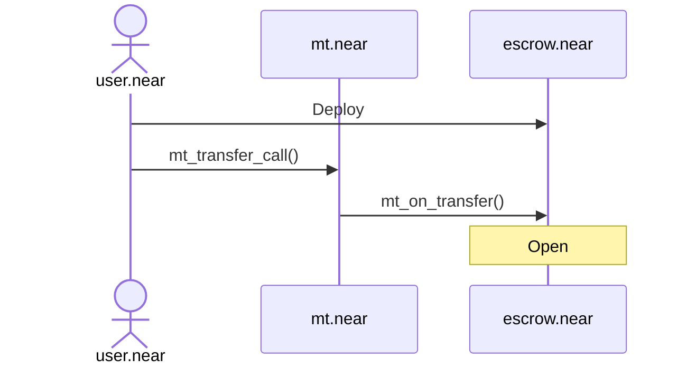
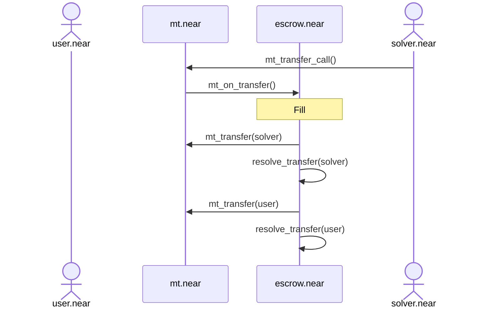

# Escrow Contract

## Open

```mermaid
sequenceDiagram
    actor user as user.near
    participant mt as mt.near
    participant escrow as escrow.near

    user ->> escrow: Deploy
    user ->> mt: mt_transfer_call()
    mt ->> escrow: mt_on_transfer()
    Note over escrow: Open
```

## Fill

```mermaid
sequenceDiagram
    actor user as user.near
    participant mt as mt.near
    participant escrow as escrow.near
    actor solver as solver.near

    solver ->> mt: mt_transfer_call()
    mt ->> escrow: mt_on_transfer()
    Note over escrow: Fill
    escrow ->> mt: mt_transfer(solver)
    escrow ->> escrow: resolve_transfer(solver)

    escrow ->> mt: mt_transfer(user)
    escrow ->> escrow: resolve_transfer(user)
```