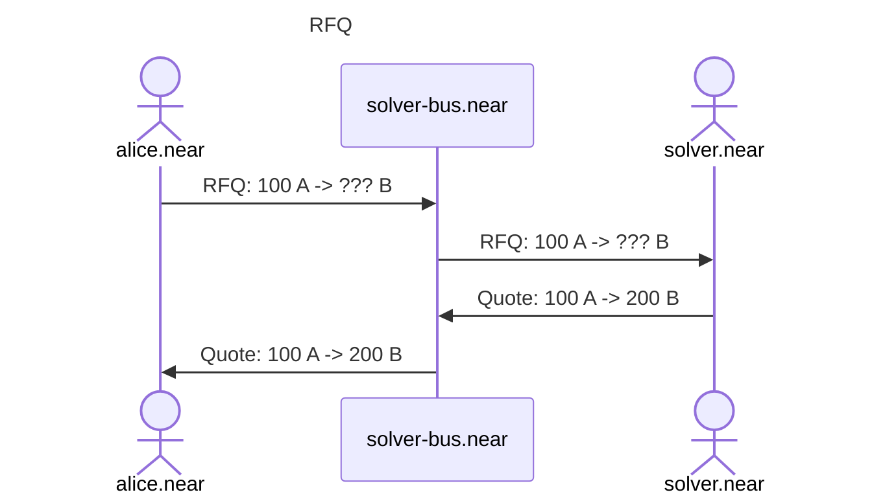
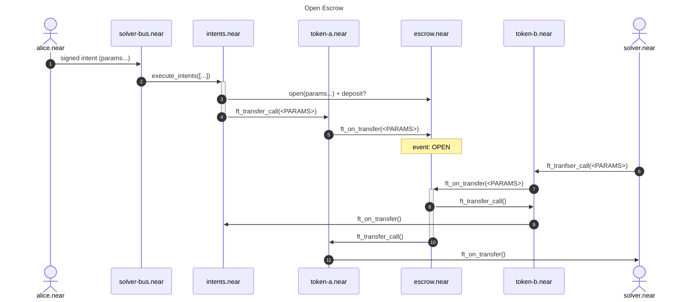

# RFQ process:




# Open Escrow




TODO:
* Limit Orders
* Dutch Auction
* Oracle price verify
* DCA
* Streaming swaps
* 


alice.near signs:

```
DelegateAction: wrap.near::ft_transfer_call({
    "receiver_id": "escrow.near", // or deterministic per-swap account-id?
    "amount": "100",
    "msg": {
        "intent": "", // intent type???
        "id": "", // derive deterministically from intent data???
        "in": [{
            "asset": "nep141",
            "contract_id": "wrap.near",
            "amount": "100",
            "msg": "<MESSAGE>", // optionally notify the receiver?
        }],
        "out": [{
            "asset": "nep141",
            "contract_id": "usdt.tether-token.near",
            "amount": "200",
            "msg": "<MESSAGE>", // optionally notify the receiver?
        }],
        // TODO: cancelling authority
    }
})
```

Asset types:
* `nep141`
  * `contract_id`
  * `amount`: dutch auction?
  * `memo`: optional
  * `msg`: optional
* `nep171`
  * `contract_id`
  * `token_id`
  * `amount`
  * `memo`: optional
  * `msg`: optional
* `nep245`
  * `contract_id`
  * `token_id`
  * `amount`
  * `memo`: optional
  * `msg`: optional
* `resolver`
  * `account_id`
  * order ID???

Operations:
* `deposit`/`open`
* `close`
* `change`: add amount_in or decrese amount_out


create (by withdrawal from intents.near, can be concurrent)
-> ft_on_transfer() (1): msg: create order, assets_in: ...
-> ft_on_transfer() (2): msg: create order, assets_in: ...
==== emit event: CREATED {} ====


TODO: storage_deposits for receivers?
what if failed? let the receiver claim the tokens one more time?
