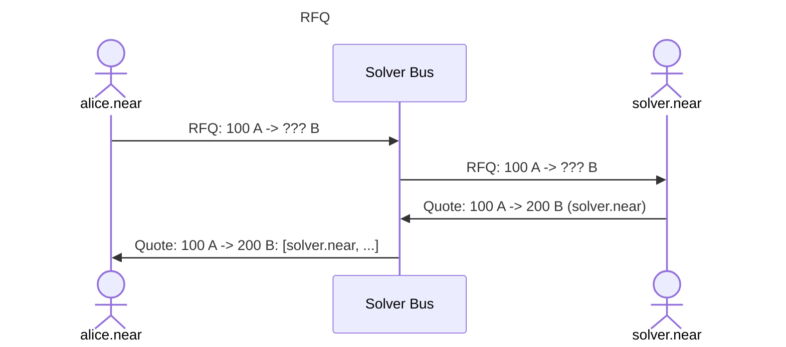
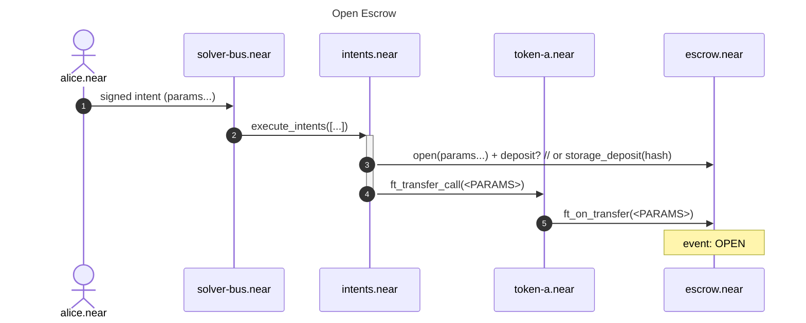
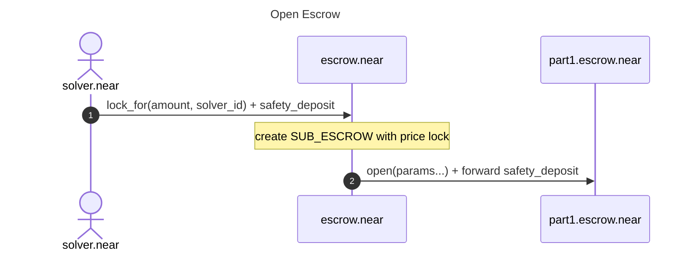
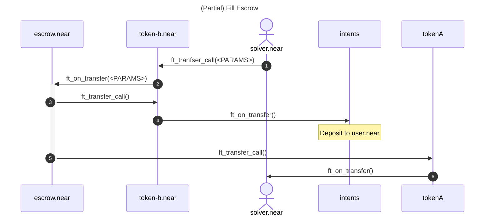

# RFQ process:




# Open Escrow

## Params

```json5
{
  "maker_asset": {
    // ft_on_transfer(), nft_on_transfer(), mt_on_transfer(), custom_receive() 
    "asset": "nep141", // options: nep141, nep171, nep245, sFT, pizza?
    "contract_id": "wrap.near",
    "amount": "1000",
  },
  "taker_asset": {
    "asset": "nep141", // options: nep141, nep171, nep245, sFT, pizza? (custom_resolve()), hash_lock
    "contract_id": "usdt.tether-token.near",
    "amount": {
      "strategy": "fixed", // options: fixed, dutch_auction, dca, etc...?
      "amount": "2500",
      "deadline": "2025-08-27T10:05:00Z",
    },
    // or
    "amount": {
      "strategy": "dutch_auction", // TODO: make it modular: i.e. call other smart-contract
      "price_curve": "linear", // how price decreases between price_points below
      "price_points": [{
        "timestamp": "2025-08-27T10:00:00Z", // start point
        "amount": "2600",
      }, {
        "timestamp": "2025-08-27T10:01:00Z",
        "amount": "2500",
      }, {
        "timestamp": "2025-08-27T10:02:00Z",
        "amount": "2450",
      }, {
        "timestamp": "2025-08-27T10:30:00Z", // last point
        "amount": "2300",
      }]
    },
    // or
    "amount": {
      "strategy": "dca",
      "oracle": {
        "type": "pyth",
        "contract_id": "pyth.near",
      },
      "every": "3600", // (seconds) every 1 hour
      "fraction": "100", // (pips) sell 1% each time
    },
    "allow_partial_fills": "true",
    "whitelist": ["solver.near", ...], // or Merkle tree? TODO: no whitelist?

    "receive_to": "user.near", // example: "intents.near" (to deposit back to user)
    "msg": "<msg for ft_on_transfer()>", // optional
  },
}
```

## Flow



# (Partial) Lock for solver




# Fill Escrow





TODO:
* Limit Orders
* Dutch Auction
* Oracle price verify
* DCA
* 


alice.near signs:

```
DelegateAction: wrap.near::ft_transfer_call({
    "receiver_id": "escrow.near", // or deterministic per-swap account-id?
    "amount": "100",
    "msg": {
        "intent": "", // intent type???
        "id": "", // derive deterministically from intent data???
        "in": [{
            "asset": "nep141",
            "contract_id": "wrap.near",
            "amount": "100",
            "msg": "<MESSAGE>", // optionally notify the receiver?
        }],
        "out": [{
            "asset": "nep141",
            "contract_id": "usdt.tether-token.near",
            "amount": "200",
            "msg": "<MESSAGE>", // optionally notify the receiver?
        }],
        // TODO: cancelling authority
    }
})
```

Asset types:
* `nep141`
  * `contract_id`
  * `amount`: dutch auction?
  * `memo`: optional
  * `msg`: optional
* `nep171`
  * `contract_id`
  * `token_id`
  * `amount`
  * `memo`: optional
  * `msg`: optional
* `nep245`
  * `contract_id`
  * `token_id`
  * `amount`
  * `memo`: optional
  * `msg`: optional
* `resolver`
  * `account_id`
  * order ID???
* HTLC: merkle tree root hash

Operations:
* `deposit`/`open`
* `close`
* `change`: add amount_in or decrese amount_out


* Limit Orders vs Market orders:
market order should be a separate order type which guarantees to be filled around market current price


create (by withdrawal from intents.near, can be concurrent)
-> ft_on_transfer() (1): msg: create order, assets_in: ...
-> ft_on_transfer() (2): msg: create order, assets_in: ...
==== emit event: CREATED {} ====


TODO: storage_deposits for receivers?
what if failed? let the receiver claim the tokens one more time?

TODO: safety deposit on both HTLC escrows as an incentive for solvers to finalize both sides

TODO: how to measure ETA for swap to be filled?


