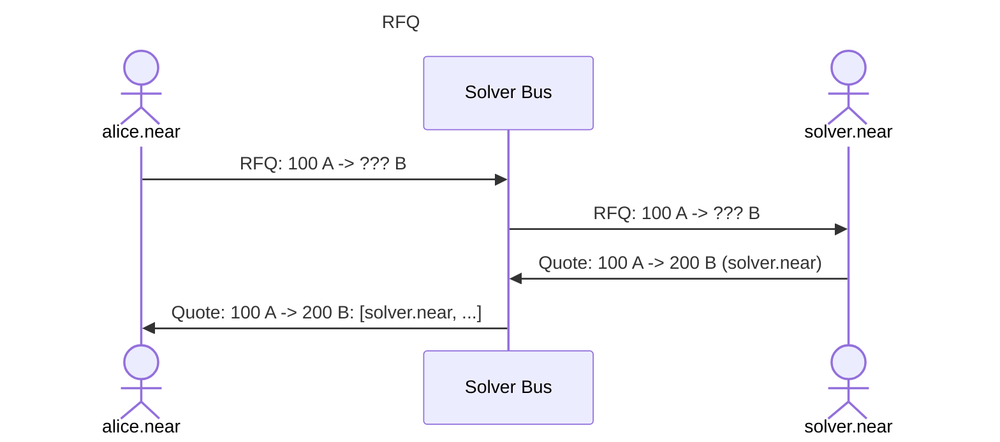
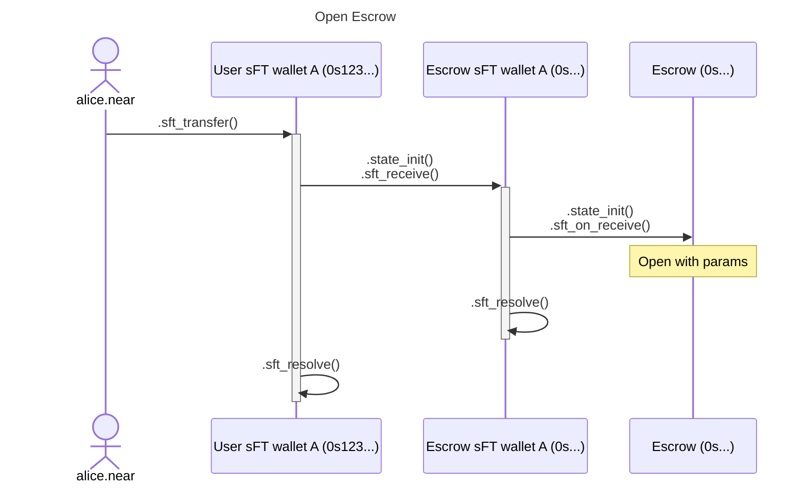
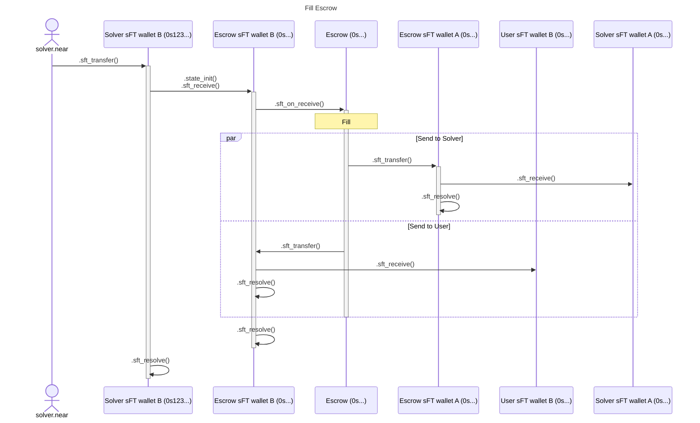
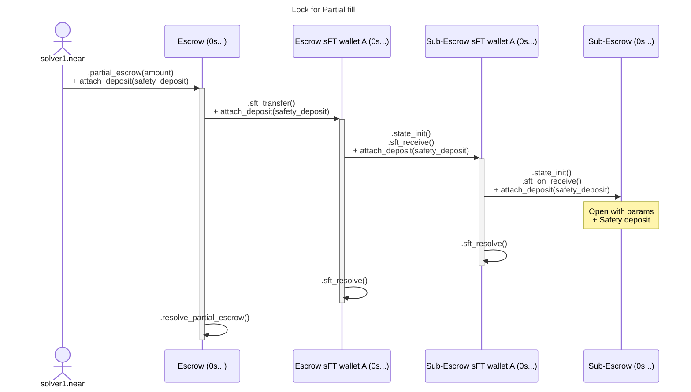

# Sharded Escrow smart-contracts

Escrow is a contract that locks funds under specific terms and unlocks them when these conditions were met.

## Why not "Vaults"?

Logic of supported conditions is the core logic of escrow smart-contract. So, if another external contract is responsible for this logic, then it makes no sense to introduce this intermediary "escrow" contract that only forwards `.*_transfer()` Promises from a single whitelisted "owner".  
This logic is already implemented by FT/sFT contracts.

## Why sharded (i.e. deterministic per-escrow) contracts?

### Pros:

* Sharding == more throughput

* ZBAs let us avoid `.storage_deposit()` if we fit into these limits.
  Storage Management is a pain.

  Moreover, If a user doesn't have NEAR, then he needs first to buy it.  
  But what if he trades some instantly-illiquid tokens and can't sell small portion of it right away? What about NFTs?

* Ecosystem projects will have a propper primitive instead of building on top of legacy approaches.

### Cons:
* Slower settlement?  
  We do XCCs anyway, so few more blocks for async interactions is ok IMO

## Authentication

User authentication is ideally permofmed by per-user wallet-contracts with Deterministic AccountIds from NEP-616.
In short-term we can use `intents.near` for that.

## RFQ process:

## Escrow Params

* Maker Asset
* Maker Amount: fixed

* Taker Asset (or `.custom_resolve()` for pizza case)
* Taker Amount
  * Fixed: (optional) + slippage
  * Dutch Auction: price points
  * Market Orders: via oracle-verified price within slippage
* Allow partial fills?
* Deadline
* Solvers whitelist (optional)
* `receiver_id` for Taker Asset
* Fee receiver

### Escrow Actions

* Open
* (Partial) Fill
* Increase Maker Amount / Decrease Taker Amount
* Cancel: after `deadline` passed 

## Open Escrow

Here is a full flow with sharded FTs.
The same can be achieved via non-sharded FTs, but it would require sending separate `.state_init()`, which complicates things a bit.

### Fill Escrow

### Partial fills (via safety deposit)

#### Lock

#### Fill

Same as non-partial fills, but also refund `safety_deposit` to `solver1.near`.

### What we need
* NEP for sFT standard
  > Reference implementation already exists
* Indexing of all global contracts usages
  > Should be relatively easy, already discussed with @Anton Astafiev
* Indexing for all sFT mints/transfers/burns
* Indexing for all escrow contracts

### One Click Swap as Escrow

Why to even bother with implementing temporary non-sharded smart-contracts if we can live for now with escrow implemented as EOAs via 1CS?