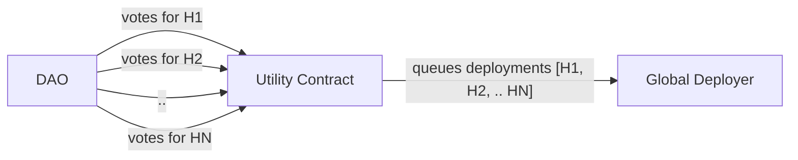
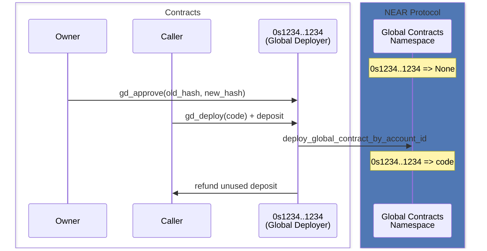
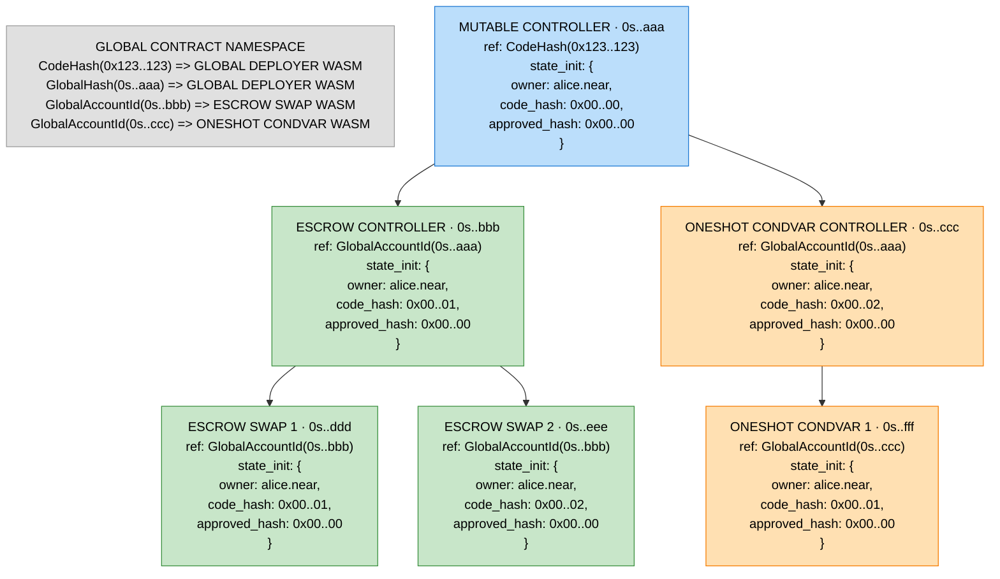

# Global Deployer

A minimal contract for managing global contract code on deterministic ([NEP-616](https://github.com/near/NEPs/blob/master/neps/nep-0616.md)) accounts. It implements the upgrade mechanism for [NEP-591 Global Contracts](https://github.com/near/NEPs/blob/master/neps/nep-0591.md).

## Two-Step Deployment

Deployments are split into two steps:

1. **Approve** (`gd_approve`) — the owner (typically a DAO) votes for a specific code hash
2. **Deploy** (`gd_deploy`) — anyone can execute the deployment by submitting the matching WASM binary + storage deposit

### Why permissionless deploy?

The deploy step requires attaching the full WASM binary and a storage deposit. This is error-prone (misconfigured deposit, large transaction). By separating approval from execution, the DAO only votes for a well-known code hash (e.g. from GitHub releases), and a dedicated operator or bot handles the actual deployment mechanics.

### Design philosophy

The contract is intentionally slim and low-level. More sophisticated workflows can be built on top by composing utility contracts as owners. For example, only one hash can be approved at a time — each new approval erases the previous one. If consecutive multi-stage upgrades are needed, a utility contract can queue approvals and forward them one-by-one after each previous deployment completes:

## Contract State

| Field           | Type        | Default      | Description                                       |
|-----------------|-------------|--------------|---------------------------------------------------|
| `owner_id`      | `AccountId` | set at init  | Account authorized to approve deployments and transfer ownership |
| `code_hash`     | `[u8; 32]`  | `0x000...000` | SHA-256 hash of the currently deployed code       |
| `approved_hash` | `[u8; 32]`  | `0x000...000` | SHA-256 hash of the next approved deployment      |

## Public API

### `gd_approve(old_hash, new_hash)`

Sets the approved hash for the next deployment.

- **Access**: owner only
- **Deposit**: 1 yoctoNEAR
- **Params**: `old_hash` must match current `code_hash` (prevents stale approvals), `new_hash` is the SHA-256 of the WASM to deploy next
- **State change**: sets `approved_hash` to `new_hash`
- **Events**: `Approve { code_hash: new_hash, reason: By(caller) }`

### `gd_deploy(code)`

Deploys WASM code as a global contract on this account.

- **Access**: permissionless
- **Deposit**: enough to cover storage delta
- **Params**: `code` (borsh-serialized WASM binary) — `sha256(code)` must equal `approved_hash`
- **State change**: `code_hash = sha256(code)`, `approved_hash = 0x000...000`
- **Events**: [`Deploy { code_hash }`, `Approve { code_hash: 0x000...000, reason: Deploy(code_hash) }` ]
- **Refund**: unused deposit is returned to the caller

### `gd_transfer_ownership(receiver_id)`

Transfers contract ownership to a new account.

- **Access**: owner only
- **Deposit**: 1 yoctoNEAR
- **Params**: `receiver_id` — must differ from current owner
- **State change**: `owner_id = receiver_id`, `approved_hash = 0x000...000`
- **Events**: `Transfer { old_owner_id, new_owner_id }`, then `Approve { code_hash: 0x000...000, reason: By(new_owner_id) }`

### `gd_owner_id() → AccountId`

Returns the current owner's account ID. View method.

### `gd_code_hash() → hex string`

Returns the SHA-256 hash of the currently deployed code (or `0x000...000` if none). View method.

### `gd_approved_hash() → hex string`

Returns the currently approved hash (or `0x000...000` if none). View method.

## Events

All events follow [NEP-297](https://github.com/near/NEPs/blob/master/neps/nep-0297.md) with standard `"global-deployer"` version `"1.0.0"`.

| Event      | Fields                         | Description                                                                                                  |
|------------|---------------------------------|--------------------------------------------------------------------------------------------------------------|
| `Approve`  | `code_hash`, `reason`          | Approved hash changed                                                                                         |
| `Deploy`   | `code_hash`                    | Code was deployed                                                                                            |
| `Transfer` | `old_owner_id`, `new_owner_id` | Ownership was transferred                                                                                    |

## Deployment Flow

## Deployment Hierarchy

### How Global Contracts Work

[NEP-591](https://github.com/near/NEPs/blob/master/neps/nep-0591.md) introduces a protocol-level **Global Contract Namespace** — a mapping from identifiers to WASM contract code. Instead of each account storing its own copy of contract code, accounts reference global contracts via `UseGlobalContractAction`. Two deployment modes are supported:

- **Deploy-by-hash** (`GlobalContractDeployMode::CodeHash`): immutable — contract code is referenced by its SHA-256 hash. Cannot be changed after deployment.
- **Deploy-by-account-id** (`GlobalContractDeployMode::AccountId`): upgradeable — the owner can redeploy code. All references auto-update since they point to the account, not the hash.

### Bootstrap Process

1. Deploy GD globally **by code hash** (one-time, immutable)
2. Instantiate Controller with `StateInit` referencing GD's code hash → deterministic address
3. Controller calls `gd_approve` + `gd_deploy` of the same GD code under its own account ID
4. Controller is now a **mutable** GD instance (can upgrade GD itself)
5. Instantiate Escrow Controller referencing Controller's account ID + unique `code_hash` in `StateInit` (e.g. `0x...01`)
6. `gd_approve` + `gd_deploy` escrow WASM on that instance
7. From Escrow Controller, create individual Escrow Swap instances
8. Repeat for MT Receiver with a different `code_hash` in `StateInit` (e.g. `0x...02`)

### Hierarchy Diagram

### Multi-Stage Deployment

If consecutive upgrades are needed (e.g. H1 → H2 → H3), they can be prepared upfront. Since `gd_approve` takes the current `code_hash` as `old_hash`, each approval call simply references the code hash of the previously approved WASM binary. As long as you know the hashes of all consecutive binaries in advance, the full chain of `gd_approve` + `gd_deploy` calls can be queued and executed sequentially.

### Important Notes

- A deterministic account ID is derived from `StateInit` at creation. After `gd_approve` mutates state, on-chain state diverges from what the address was derived from.
- Upgrading Controller code propagates to all future instances (deploy-by-account-id).
- The GD deployed by hash once is the **immutable foundation** for the whole hierarchy.
