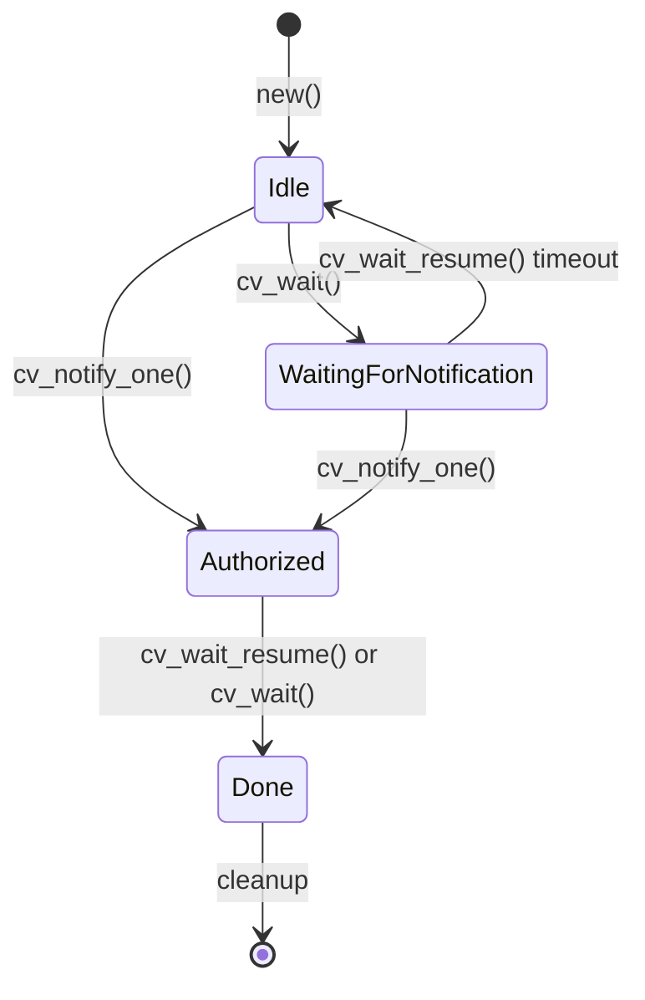

# OneshotCondVar

A oneshot condition variable smart contract for NEAR blockchain.

## Concept

This contract combines two Rust synchronization primitives:

1. **Oneshot Channel** - Can only be used once; after signaling, the contract self-destructs
2. **Condition Variable** - One party waits (`cv_wait`) while another notifies (`cv_notify_one`)

### Why "OneshotCondVar"?

- **Oneshot**: The contract can only complete one notification cycle, then cleans itself up
- **CondVar**: Exposes `cv_wait()` and `cv_notify_one()` semantics similar to `std::sync::Condvar`

## State Machine



## States

| State | Description |
|-------|-------------|
| `Idle` | Initial state. Ready for `cv_wait()` or `cv_notify_one()` |
| `WaitingForNotification` | `cv_wait()` called, yield promise active waiting for notification |
| `Authorized` | `cv_notify_one()` called, notification received |
| `Done` | Terminal state, triggers contract cleanup |

## State Transitions

| From State | Method | To State | Notes |
|------------|--------|----------|-------|
| `Idle` | `cv_wait()` | `WaitingForNotification` | Creates yield promise |
| `Idle` | `cv_notify_one()` | `Authorized` | No yield to resume |
| `WaitingForNotification` | `cv_notify_one()` | `Authorized` | Resumes yield (may fail if timed out) |
| `WaitingForNotification` | `cv_wait_resume()` timeout | `Idle` | Emits `Timeout` event, can retry |
| `Authorized` | `cv_wait()` | `Done` | Immediate success, no yield |
| `Authorized` | `cv_wait_resume()` | `Done` | Yield resumed or race condition |

## Execution Paths

### Path 1: cv_wait() then cv_notify() (Happy path)

```
Idle ──cv_wait()──► WaitingForNotification ──cv_notify_one()──► Authorized ──cv_wait_resume()──► Done
```

1. `cv_wait()`: Creates yield promise, state → `WaitingForNotification`
2. `cv_notify_one()`: Resumes yield, state → `Authorized`
3. `cv_wait_resume()` callback: State → `Done`, returns `true`

### Path 2: cv_wait() Timeout

```
Idle ──cv_wait()──► WaitingForNotification ──timeout──► Idle (can retry)
```

1. `cv_wait()`: Creates yield promise, state → `WaitingForNotification`
2. Yield times out
3. `cv_wait_resume()` callback: State → `Idle`, emits `Timeout`, returns `false`

### Path 3: cv_notify() then cv_wait() (Notify first)

```
Idle ──cv_notify_one()──► Authorized ──cv_wait()──► Done
```

1. `cv_notify_one()`: State → `Authorized`
2. `cv_wait()`: Immediate success, state → `Done`, returns `true`

### Path 4: Race Condition (Timeout + Late Notification)

```
Idle ──cv_wait()──► WaitingForNotification ──(yield times out)──► cv_notify_one() ──► Authorized ──cv_wait_resume()──► Done
```

1. `cv_wait()`: State → `WaitingForNotification`
2. Yield times out internally (callback not yet executed)
3. `cv_notify_one()` arrives: `yield.resume()` fails, but state → `Authorized`
4. `cv_wait_resume()` callback: Sees `Authorized` → `Done`, returns `true`

## Error Conditions

| Current State | Method | Error |
|---------------|--------|-------|
| `WaitingForNotification` | `cv_wait()` | "already waiting for notification" |
| `Done` | `cv_wait()` | "already done" |
| `Authorized` | `cv_notify_one()` | "already notified" |
| `Done` | `cv_notify_one()` | "already notified" |

## API

### `cv_wait() -> PromiseOrValue<bool>`
Called by the `authorizee` to wait for notification. Returns:
- `true` if notification received (state becomes `Done`)
- `false` if timeout occurred (state resets to `Idle`, can retry)

### `cv_notify_one()`
Called by the `on_auth_signer` to signal notification. Wakes up any waiting `cv_wait()`.

### `cv_is_notified() -> bool`
Returns `true` if state is `Authorized` or `Done`.

## Usage Pattern

```
Party A (authorizee)          Contract              Party B (on_auth_signer)
       |                         |                         |
       |------- cv_wait() ------>|                         |
       |                    [WaitingForNotification]       |
       |                         |<--- cv_notify_one() ----|
       |                    [Authorized]                   |
       |<-- cv_wait_resume() ----|                         |
       |      returns true  [Done]                         |
       |                    [cleanup]                      |
```
