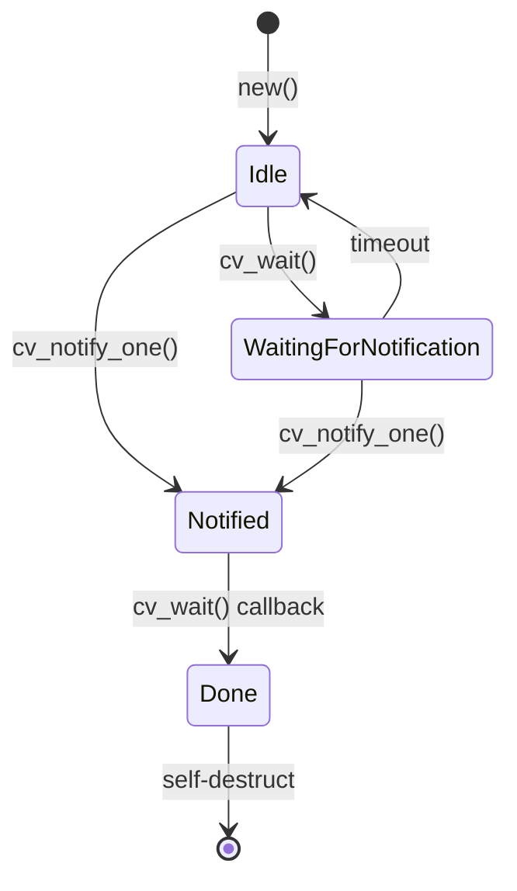

# OneshotCondVar

A oneshot condition variable smart contract for NEAR blockchain.

## Concept

This contract combines two Rust synchronization primitives:

1. **Oneshot Channel** - Can only be used once; after signaling, the contract self-destructs
2. **Condition Variable** - One party waits (`cv_wait`) while another notifies (`cv_notify_one`)

### Why "OneshotCondVar"?

- **Oneshot**: The contract can only complete one notification cycle, then cleans itself up
- **CondVar**: Exposes `cv_wait()` and `cv_notify_one()` semantics similar to `std::sync::Condvar`

## State Machine



## State Descriptions

| State | Description |
|-------|-------------|
| `Idle` | Initial state, waiting for either party to act |
| `WaitingForNotification` | `cv_wait()` called, yield promise active |
| `Notified` | `cv_notify_one()` called, waiting for callback |
| `Done` | Complete, contract will self-destruct |

## API

### `cv_wait() -> PromiseOrValue<bool>`
Called by the `authorizee` to wait for notification. Returns:
- `true` if notification received
- `false` if timeout occurred (state resets to Idle)

### `cv_notify_one()`
Called by the `on_auth_signer` to signal notification. Wakes up any waiting `cv_wait()`.

### `cv_is_notified() -> bool`
Returns whether the contract has been notified.

## Usage Pattern

```
Party A (authorizee)          Contract              Party B (notifier)
       |                         |                         |
       |------- cv_wait() ------>|                         |
       |                         |<--- cv_notify_one() ----|
       |<------ true ------------|                         |
       |                     [self-destruct]               |
```
